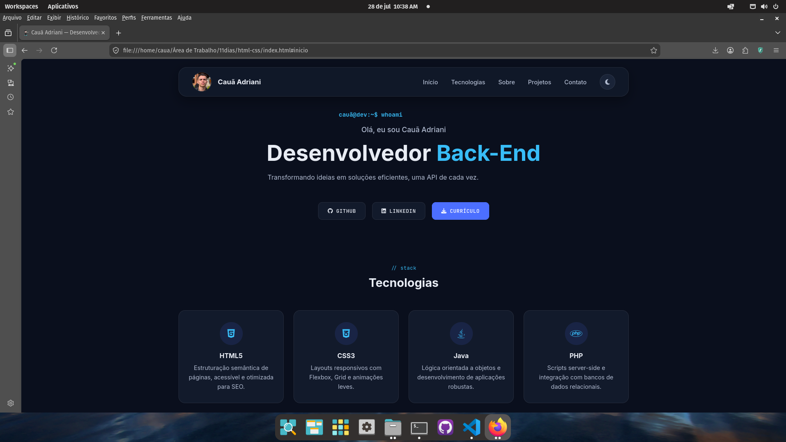
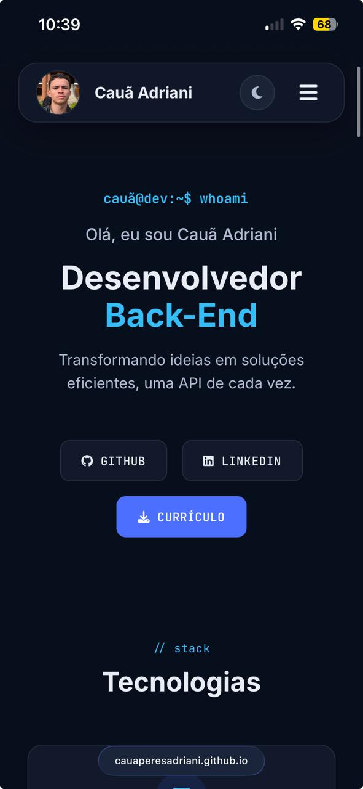

# 💼 Portfólio Pessoal

<p align="center">

Meu portfólio desenvolvido para apresentar minhas habilidades, projetos e evolução como Desenvolvedor Back-End Java.

</p>

<p align="center">


</p>

---

## 🌐 Acesse

🔗 **Site**

https://cauaperesadriani.github.io/Portifolio/

📂 **Repositório**

https://github.com/CauaPeresAdriani/Portifolio

---

# 📖 Sobre

Este projeto foi desenvolvido com o objetivo de criar um portfólio moderno, responsivo e intuitivo para apresentar minha trajetória na programação, tecnologias dominadas e projetos desenvolvidos.

Além da apresentação profissional, o projeto serviu para aprofundar conhecimentos em desenvolvimento Front-End utilizando HTML, CSS e JavaScript puro, aplicando boas práticas de organização, acessibilidade e responsividade.

---

# ✨ Funcionalidades

- ✅ Tema claro e escuro
- ✅ Persistência do tema com LocalStorage
- ✅ Layout totalmente responsivo
- ✅ Loader animado simulando terminal
- ✅ Hero Section
- ✅ Cards de tecnologias
- ✅ Timeline de formação
- ✅ Objetivos profissionais
- ✅ Barra de progresso de estudos
- ✅ Estatísticas
- ✅ Projetos
- ✅ Contato
- ✅ Download do currículo
- ✅ Navegação por âncoras
- ✅ Animações suaves
- ✅ Ícones Font Awesome

---

# 🛠 Tecnologias

### Front-End

- HTML5
- CSS3
- JavaScript ES6+

### Ferramentas

- Git
- GitHub
- GitHub Pages
- VS Code

### Bibliotecas

- Font Awesome
- Google Fonts

---

# 📷 Preview

## Desktop





---

## Mobile




---

# 📂 Estrutura do projeto

```text
Portifolio/

assets/
│
├── docs/
├── icons/
├── img/
└── js/
    └── script.js

index.html
style.css
README.md
```

---

# 🚀 Como executar

Clone o projeto

```bash
git clone https://github.com/CauaPeresAdriani/Portifolio.git
```

Entre na pasta

```bash
cd Portifolio
```

Abra o arquivo

```text
index.html
```

ou utilize a extensão **Live Server** do VS Code.

---

# 📱 Responsividade

O projeto foi desenvolvido para funcionar em diferentes resoluções.

- Desktop
- Notebook
- Tablet
- Smartphone

---

# ♿ Acessibilidade

Algumas boas práticas aplicadas:

- HTML semântico
- Meta Description
- Favicon
- Contraste adequado
- Navegação por teclado
- Focus visível
- Imagens com atributo `alt`
- Uso de `<main>`, `<header>` e `<footer>`

---

# 📈 Melhorias implementadas

- Organização do JavaScript em funções
- Persistência do tema
- Otimização do carregamento
- Melhorias de Performance (Lighthouse)
- Responsividade aprimorada
- Correções de Layout Shift (CLS)
- Otimização das imagens

---

# 🔮 Próximas melhorias

- Menu hambúrguer
- Animações com Intersection Observer
- Internacionalização (PT/EN)
- Página 404 personalizada
- Projetos consumindo APIs reais
- Integração com GitHub API
- Formulário de contato

---

# 📚 Aprendizados

Durante o desenvolvimento deste projeto foram praticados conceitos como:

- HTML semântico
- Flexbox
- CSS Grid
- Responsividade
- Media Queries
- Variáveis CSS
- Tema Dark/Light
- Manipulação do DOM
- Eventos
- LocalStorage
- Organização de código
- Git Flow
- GitHub Pages

---

# 👨‍💻 Autor

**Cauã Adriani**

GitHub

https://github.com/CauaPeresAdriani

LinkedIn

https://www.linkedin.com/in/cauã-peres-adriani-3347a1321/

---

# ⭐ Gostou?

Se este projeto foi interessante, deixe uma ⭐ no repositório.
